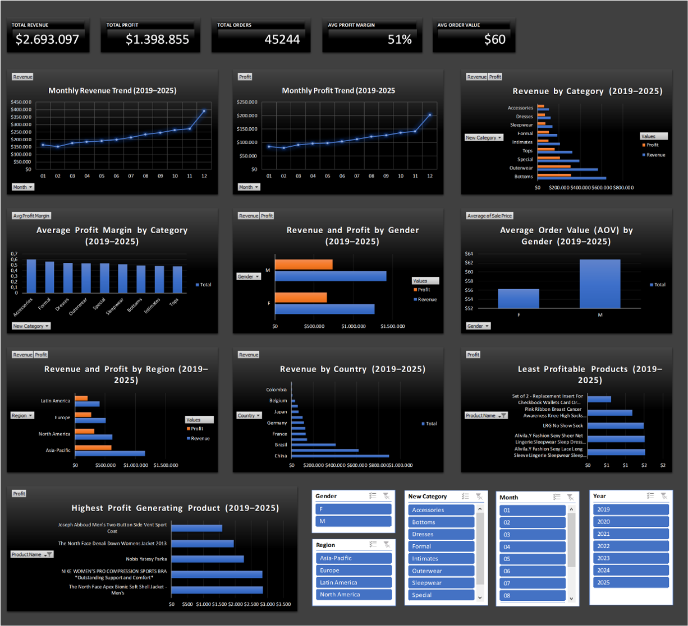

# E-Commerce Sales & Profit Analysis Dashboard (Excel)

## Project Overview

This project analyzes transaction-level e-commerce data sourced from a Google BigQuery public dataset, covering the period from January 2019 to December 2025.  
The analysis focuses on understanding sales performance, profitability, customer behavior, product contribution, and regional performance through an interactive Excel dashboard designed for business reporting.

---

## Dashboard Preview

*Interactive Excel dashboard summarizing revenue, profit, customer, product, and regional performance.*

## Business Questions

The analysis aims to answer the following questions:

1. How do revenue and profit trend over time?
2. Which product categories contribute the most revenue and which deliver the highest margins?
3. Are there differences in customer performance by gender, including Average Order Value (AOV)?
4. Which regions and countries drive the majority of revenue and profit?
5. Which products are the most profitable and which underperform?

---

## Dataset

Source: Google BigQuery – Public E-commerce Dataset

Main fields used:
- Order Date, Month, Year  
- Order ID  
- Gender  
- Country, Region  
- Category and Recategorized Product Group  
- Product Name  
- Sale Price, Cost, Profit  
- Profit Margin  

The dataset was cleaned and structured prior to analysis.

---

## Tools & Methods

- Google BigQuery  
  - SQL for data extraction and initial transformation  

- Microsoft Excel  
  - Pivot Tables and Calculated Fields  
  - Pivot Charts  
  - KPI Cards  
  - Slicers for interactive filtering  
  - Single-page executive dashboard  

---

## Key Insights

### Revenue & Profit Trend
- Total revenue reached $2.69M, generating $1.40M in profit.
- Revenue and profit show a steady upward trend over the analysis period.
- December consistently records the highest revenue and profit, indicating strong year-end seasonality.
- A significant share of total profit is generated in Q4.

### Category Performance
- Bottoms is the largest revenue contributor at approximately $642K.
- Accessories delivers the highest average profit margin at 60%, despite lower revenue.
- Formal and Dresses categories show strong profitability.
- Tops generates high revenue but relatively lower margins, indicating cost or pricing pressure.

### Customer Gender Analysis
- Male customers generate higher revenue ($1.42M) and profit ($736K).
- Average Order Value (AOV) is higher for male customers ($62.7) compared to female customers ($56.3).
- Female customers remain an important segment due to transaction volume.

### Regional & Country Performance
- Asia-Pacific is the top-performing region in both revenue ($1.16M) and profit ($603K).
- North America and Europe show stable and balanced profitability.
- Revenue is concentrated in China and the United States.
- Several countries contribute minimal revenue, indicating limited market penetration.

### Product Profitability
- Profit contribution follows a Pareto pattern, where a small number of products generate most of the profit.
- Outerwear products dominate the top-performing items.
- Low-performing products generate minimal profit, often due to low pricing or high costs.
- Product rationalization could improve overall efficiency.

---

## Dashboard Overview

The Excel dashboard includes:

KPI Summary:
- Total Revenue  
- Total Profit  
- Total Orders  
- Average Profit Margin  
- Average Order Value (AOV)  

Visual Analysis:
- Monthly Revenue and Profit Trend  
- Revenue and Margin by Category  
- Revenue and Profit by Gender  
- Regional and Country-level Performance  
- Top and Bottom Products by Profit  

Interactive Filters:
- Year  
- Month  
- Region  
- Category  
- Gender  

All visuals respond dynamically to slicer selections.

---

E-Commerce-Excel-Dashboard
│── README.md
│── Ecommerce_Sales_Dashboard.xlsx
│── images
│   └── dashboard_preview.png
│── data
│   └── ecommerce_data.csv

---

## Conclusion

This project demonstrates an end-to-end Excel-based analytics workflow, from data extraction in BigQuery to insight delivery through an interactive dashboard.  
The analysis supports business decision-making by highlighting growth drivers, margin opportunities, and underperforming areas across products, customers, and regions.
